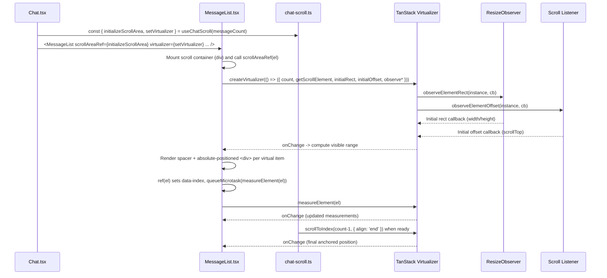
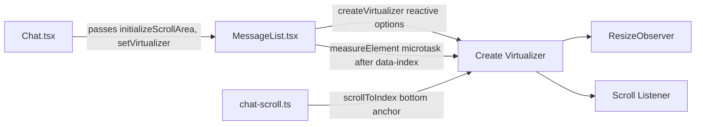

# Chat Virtualization & Auto-Scroll (TanStack Virtual + SolidJS)

This document explains the root cause of the chat auto-scroll issue with virtualization, the fix we implemented, and how to wire it up correctly in SolidJS using TanStack Virtual.

- Files: `src/components/chat-components/MessageList.tsx`, `src/lib/chat-scroll.ts`, `src/components/Chat.tsx`
- Library: `@tanstack/solid-virtual@3.13.12`

## Summary (TL;DR)

- Virtualizer initially didn’t activate reliably: sometimes `itemCount` was `0` and `visibleRange` was `null` even though `totalSize` looked sane.
- The measured element emitted: “Missing attribute name 'data-index={index}' on measured element.”
- Fix:
  - Create the virtualizer via the Solid adapter’s reactive options function and read reactive sources inside it (count, scroll element).
  - Seed `initialRect` and `initialOffset` so a visible range can compute before observers fire.
  - Provide instance-based `observeElementRect` (ResizeObserver) and `observeElementOffset` (scroll listener) that invoke their callbacks immediately once bound.
  - Enable `useAnimationFrameWithResizeObserver` to smooth RO thrashing.
  - Ensure each measured item sets `data-index` before calling `measureElement`, and defer the measure to a microtask in the `ref` callback.
  - Render the spacer element and gate fallback rendering until the container is measured.
  - Keep adapter-owned observers intact (no manual setOptions churn) and add dev logging for lifecycle/scroll.

## Implementation Details

### 1) Virtualizer creation (reactive options + observers)

In `src/components/chat-components/MessageList.tsx`, we create the virtualizer with a reactive options function. This lets the adapter subscribe to any reactive values read inside (like message count and the scroll element):

```tsx
// MessageList.tsx (excerpt)
const virtualizer = createVirtualizer((() => ({
  count: props.state.messages.length,
  getScrollElement: () => scrollEl() || null,
  estimateSize: () => 40,
  overscan: 15,
  initialRect: {
    top: 0,
    left: 0,
    width: scrollEl()?.clientWidth || 0,
    height: scrollEl()?.clientHeight || 400,
  },
  initialOffset: () => scrollEl()?.scrollTop || 0,
  useAnimationFrameWithResizeObserver: true,
  observeElementRect: (instance, cb) => {
    const el = instance?.scrollElement;
    if (!el) return;
    const ro = new ResizeObserver(() => {
      const width = el.clientWidth || el.getBoundingClientRect().width || 0;
      const height = el.clientHeight || el.getBoundingClientRect().height || 0;
      const { top = 0, left = 0 } = el.getBoundingClientRect?.() || {};
      cb({ width, height, top, left });
    });
    ro.observe(el);
    cb({ width: el.clientWidth, height: el.clientHeight, top: 0, left: 0 });
    return () => ro.disconnect();
  },
  observeElementOffset: (instance, cb) => {
    const el = instance?.scrollElement;
    if (!el) return;
    const onScroll = () => cb(el.scrollTop || 0);
    el.addEventListener('scroll', onScroll, { passive: true });
    cb(el.scrollTop || 0);
    return () => el.removeEventListener('scroll', onScroll);
  },
  onChange: (instance) => {
    // dev logs & reactive ticks
  },
})) as any);
```

Why: The virtualizer needs a scroll element and an initial rect/offset to compute a visible range immediately, especially before observers fire. Instance-based observers ensure stable bindings and an initial callback to populate dimensions/offset.

References:
- createVirtualizer (Solid): https://github.com/tanstack/virtual/blob/main/docs/framework/solid/solid-virtual.md
- Virtualizer options: https://github.com/tanstack/virtual/blob/main/docs/api/virtualizer.md

### 2) Measured element & Solid ref timing

Solid can call a `ref` callback before JSX attributes are applied. Since TanStack Virtual reads `data-index` during `measureElement`, we guarantee it’s present and defer measuring to the next microtask:

```tsx
// Inside <For each={virtualItems()}>
<div
  ref={(el) => {
    el.setAttribute('data-index', String(virtualItem.index));
    queueMicrotask(() => virtualizer.measureElement(el));
  }}
  data-index={virtualItem.index}
  style={{
    position: 'absolute',
    top: '0px',
    left: '0px',
    width: '100%',
    height: `${virtualItem.size}px`,
    transform: `translateY(${virtualItem.start}px)`,
  }}
>
  <MessageItem ... />
</div>
```

This removes “Missing attribute name 'data-index'…” and produces stable measurements.

### 3) Rendering model

- A spacer element uses `virtualizer.getTotalSize()` for container height.
- Items are absolutely positioned via `transform: translateY(start)` with fixed `height: size`.
- Fallback (non-virtualized) rendering is used only until the container has a non-zero measured size and a non-empty virtual range.

### 4) Auto-scroll management hook

We centralize bottom-anchored scrolling in `src/lib/chat-scroll.ts`. Prefer the virtualizer when ready, else fall back to DOM scroll, with light retrying for late readiness.

```ts
// chat-scroll.ts (snippets)
const scrollToBottom = (retryCount = 0) => {
  if (!scrollAreaRef) return;
  const count = messageCount();
  if (count === 0) return;

  if (virtualizer && virtualizer.getTotalSize && virtualizer.getTotalSize() > 0) {
    const range = virtualizer.getVirtualItems();
    if (range && range.length > 0) {
      virtualizer.scrollToIndex(count - 1, { align: 'end' });
      return;
    }
  }

  if (scrollAreaRef.scrollHeight > 0) {
    scrollAreaRef.scrollTop = scrollAreaRef.scrollHeight;
    return;
  }

  if (retryCount < 7) setTimeout(() => scrollToBottom(retryCount + 1), 100);
};

const initializeScrollArea = (el: HTMLDivElement) => {
  scrollAreaRef = el;
  if (messageCount() > 0) setTimeout(() => scrollToBottom(), 50);
};

const setVirtualizer = (v: any) => {
  virtualizer = v;
  if (messageCount() > 0) setTimeout(() => scrollToBottom(), 100);
};
```

References:
- scrollToIndex API: https://github.com/tanstack/virtual/blob/main/docs/api/virtualizer.md#scrolltoindex

### 5) Wiring in the Chat component

- Provide `messageCount` to the hook
- Pass `initializeScrollArea` to `MessageList` via `scrollAreaRef`
- Pass `setVirtualizer` to receive the virtualizer instance

```tsx
// src/components/Chat.tsx (snippets)
const messageCount = createMemo(() => messages().length);
const { initializeScrollArea, setVirtualizer } = useChatScroll(messageCount);

<MessageList
  state={compatibleState()}
  scrollAreaRef={initializeScrollArea}
  latestMessageId={latestMessageId}
  virtualizer={setVirtualizer}
  connect={chat.connect}
  clearError={chat.clearError}
/>
```

### 6) SolidJS reactivity and safety

- Use accessors (functions) instead of memos when a simple derivation is enough (e.g., `() => messages().length`).
- Guard effects to avoid circular updates. Do not update state read by the same effect without change detection.
- Group updates with `batch()` when necessary.

## Testing Checklist

- Fresh page load with existing messages: auto-scrolls to bottom
- Browser refresh on the chat page: auto-scrolls to bottom
- Sending a new message: scrolls to reveal the latest message
- Large history: virtualization is active (check `getTotalSize()`/`getVirtualItems()`), no blank gaps
- No console warning about missing `data-index` on measured elements

## Notes on TypeScript and versions

- SolidJS `1.9.7`, `@tanstack/solid-virtual@3.13.12`.
- The Solid adapter supports reactive options via a function; we cast to `any` until typings fully cover Solid accessors.
- `useAnimationFrameWithResizeObserver: true` helps reduce ResizeObserver thrashing.
- Seeding `initialRect` and `initialOffset` ensures a visible range before observers fire.

## Virtualization Flow Diagram

This sequence shows how `Chat.tsx`, `MessageList.tsx`, `chat-scroll.ts`, and the TanStack virtualizer interact.



## Component Interaction (Overview)



### Key references in code

- MessageList virtualizer creation: `src/components/chat-components/MessageList.tsx`

```tsx
const virtualizer = createVirtualizer((() => ({
  count: props.state.messages.length,
  getScrollElement: () => scrollEl() || null,
  estimateSize: () => 40,
  overscan: 15,
  initialRect: { top: 0, left: 0, width: scrollEl()?.clientWidth || 0, height: scrollEl()?.clientHeight || 400 },
  initialOffset: () => scrollEl()?.scrollTop || 0,
  useAnimationFrameWithResizeObserver: true,
  observeElementRect: (instance, cb) => { /* RO with immediate callback */ },
  observeElementOffset: (instance, cb) => { /* scroll with immediate callback */ },
})) as any);
```

- Measured element timing fix (ensure `data-index` before measuring): `src/components/chat-components/MessageList.tsx`

```tsx
<div
  ref={(el) => {
    el.setAttribute('data-index', String(virtualItem.index));
    queueMicrotask(() => virtualizer.measureElement(el));
  }}
  data-index={virtualItem.index}
  style={{ position: 'absolute', height: `${virtualItem.size}px`, transform: `translateY(${virtualItem.start}px)` }}
>
  <MessageItem ... />
</div>
```

- Auto-scroll integration: `src/lib/chat-scroll.ts`

```ts
const scrollToBottom = (retryCount = 0) => {
  if (!scrollAreaRef) return;
  const count = messageCount();
  if (count === 0) return;
  if (virtualizer?.getTotalSize?.() > 0 && virtualizer.getVirtualItems()?.length) {
    virtualizer.scrollToIndex(count - 1, { align: 'end' });
    return;
  }
  if (scrollAreaRef.scrollHeight > 0) {
    scrollAreaRef.scrollTop = scrollAreaRef.scrollHeight;
    return;
  }
  if (retryCount < 7) setTimeout(() => scrollToBottom(retryCount + 1), 100);
};
```

 ## Related Links

- TanStack Virtual (Solid): https://github.com/tanstack/virtual/blob/main/docs/framework/solid/solid-virtual.md
- Virtualizer API: https://github.com/tanstack/virtual/blob/main/docs/api/virtualizer.md
- OAuth callback SPA shim routes (dev): `src/routes/api/auth/callback/*`
